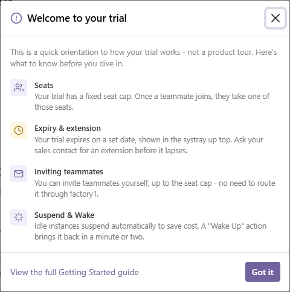
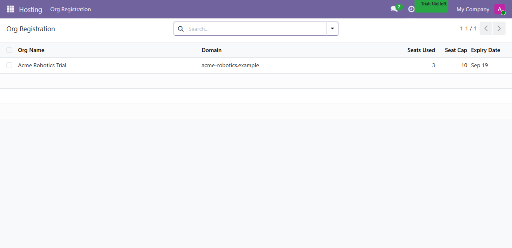
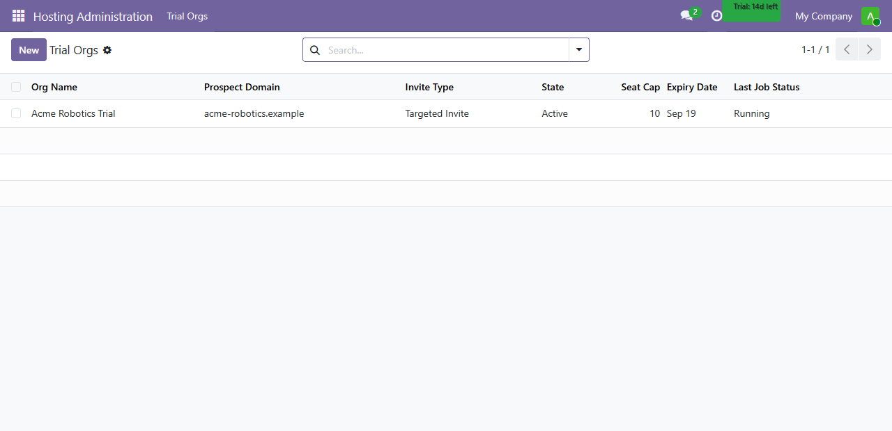

# Trial Onboarding Guide

Your Trial Org is a fully working Odoo instance, provisioned just for your prospect domain and
running for a fixed window before it's automatically torn down. This guide covers the mechanics of
that trial — seats, expiry and extension, invites, and suspend/Wake — not the CRM product itself.

## Intended Learning Outcomes

- Explain what a Seat is, how the seat count is set, and why an invite must match your trial's
  prospect domain.
- Find your trial's expiry date from the Org Registration view, and know who can push it out
  before Auto-Destroy fires.
- Tell an Open Invite Link apart from a Targeted Invite, and know what happens when someone signs
  in through each.
- Recognize the difference between a Suspended and an Active trial, and know that only an
  explicit Wake — never just visiting the URL — restarts a Suspended trial's compute.

## Seats

A Seat is a named user account inside your Trial Org. The number of seats available was set when
your trial was issued (system-wide cap: 25), and every invite you send must resolve to an email
address on your trial's own prospect domain — an invite to any other domain is rejected rather
than silently accepted.

The first-login prompt below is the first thing anyone new to the trial sees. It's shown once per
user and orients them to these same trial mechanics before they touch the product itself:

Dismissing it (or pressing Escape) doesn't lose the guide — it stays one click away afterward from
the **Getting Started** button on the Org Registration screen below.

## Org Registration: seats, expiry, and extension

Org Registration is your trial's own read-only summary — reachable from inside your Trial Org at
any time, not just on first login:

It shows seats used against your seat cap, and your trial's expiry date. Past that date,
**Auto-Destroy** permanently tears down the trial's compute and database (a short-lived, 7-day
snapshot is kept afterward in case of revival). If you need more time, ask the sales rep or manager
who owns your Opportunity for an **Extension** — they can push the expiry date out before
Auto-Destroy fires; it's not something you can do from inside the trial itself.

## Invites: Open vs. Targeted

There are two ways a new Seat gets created:

- **Targeted Invite** — sent to a specific, known email address. Confirmed by construction: the
  Seat is created for that exact address.
- **Open Invite Link** — a shareable, trial-join link not addressed to anyone in particular, used
  when the rep knows the expected prospect domain but not yet who specifically will join. The
  first person to complete login through it must confirm a company email matching your trial's
  domain before the Seat is created — a mismatched domain is rejected, not silently waved through.

## Suspended, Active, and Wake

A Trial Org is always in one of two states:

- **Active** — compute is running, the trial behaves like any normal Odoo instance.
- **Suspended** — compute has been stopped after an idle timeout to save cost. Nothing is lost:
  the database and any queued Seats are still intact.

Visiting a Suspended trial's URL does **not** restart it — it shows a static waiting page instead.
Moving from Suspended back to Active is a **Wake**, an explicit action a user takes (the "Wake Up"
button) rather than something that happens automatically. Trial administrators can see and manage
this lifecycle, plus each trial's seat cap and expiry, from the platform-side Trial Org console:

