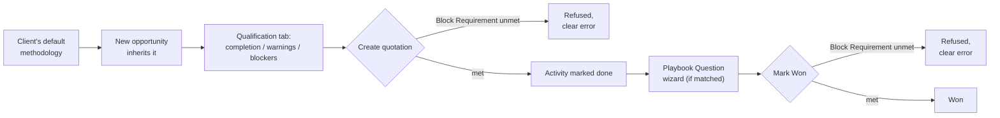
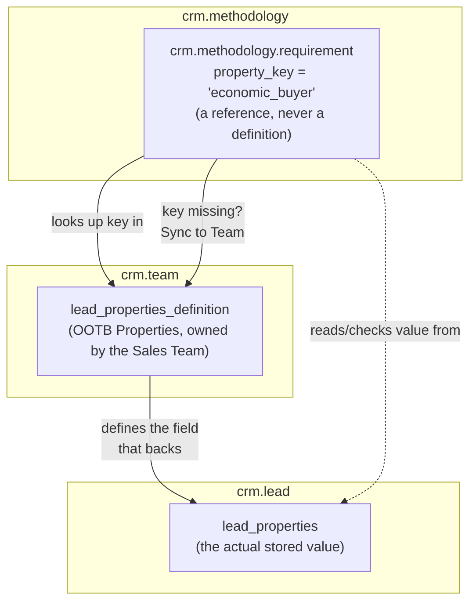

# Sales Methodology vs. OOTB Odoo CRM

*A teach doc for Sales, R&D, and Odoo consultants. Point-in-time onboarding narrative — the living reference for terminology is [`docs/contexts/crm/CONTEXT.md`](../contexts/crm/CONTEXT.md).*

## 1. How to read this doc

This is one document for three audiences, not three documents. Sections carry a tag telling you who they're mainly for — **S**ales, **R**&D, **C**onsultants — but everyone should read the narrative sections (2–6); only R&D and consultants need the technical appendix (7) onward. Inline callouts (`> For Consultants:`, `> For R&D:`) flag audience-specific asides without breaking the story.

## 2. TL;DR *(S/C)*

The `crm.methodology` addon lets a Sales Manager define named qualification frameworks (MEDDIC, Sandler, or a custom in-house one) and attach them per client. Each framework declares **Requirements** — qualification fields that must (or should) be filled in before an opportunity can move to a quotation or be marked Won — plus **Playbook Questions** that surface during discovery activities. It's a coaching and gating layer, not a pipeline replacement.

The reason it exists: OOTB Odoo 19 CRM has no concept of a named B2B sales methodology at all. That's confirmed against the actual vendored Odoo source in this repo (`addons/crm/`, `addons/sale_crm/`, `addons/sales_team/`, `addons/mail/`) — see [§10](#10-how-this-compares-to-the-broader-market-c).

## 3. Why this exists *(S/R/C)*

`docs/research/b2b-sales-methodologies-odoo.md` researched [eight named B2B methodologies](methodologies.md) (MEDDIC/MEDDPICC, Sandler, Challenger Sale, SPIN Selling, Solution Selling, CustomerCentric Selling, ValueSelling, Consultative Selling) from primary/trademark-holder sources, then checked whether OOTB Odoo 19 CRM already supported any of them. It found nothing — no methodology-specific fields, stages, or terminology anywhere in the vendored CRM/Sales/Mail modules. See [The Eight B2B Sales Methodologies](methodologies.md) for what each one actually claims, in its own trademark holder's words, and how it maps onto a `crm.methodology` configuration.

The addon's founding commit (`570fb6da`, "Implements #3") frames the need directly: Sales Managers define named Sales Methodologies; opportunities inherit their client's methodology; reps are blocked with a clear error when a Block-enforcement Requirement is unmet. The core engine shipped first, followed by demo personas so the workflow could be shown live, and a "Reset Demo Data" action so that demo can be re-run without polluting real data.

The addon deliberately does **not** try to own qualification-field storage itself. Requirements reference Odoo's native per-team `lead_properties` Properties mechanism by string key, rather than defining bespoke fields — and the reason is simple: Sales Teams already configure their own Properties, and a second, addon-owned field system would immediately fork from whatever fields a team actually uses, forcing reps to fill in the same information twice under two different names. Referencing by key keeps one field, one place, one name — the addon adds enforcement on top of data that already exists, instead of asking teams to maintain it twice. The cost is a reconciliation step when a Requirement's key doesn't yet exist on a team's Properties definition yet (see [§8](#8-design-decisions--trade-offs-rc) and [ADR 0005](../adr/0005-methodology-requirements-reference-properties-by-key.md) for the full trade-off record).

## 4. Core vocabulary *(R/C — plain-English glosses for S)*

These five terms are defined canonically in [`docs/contexts/crm/CONTEXT.md`](../contexts/crm/CONTEXT.md). This doc reuses them as-is:

| Term | Plain-English gloss |
|---|---|
| **Sales Methodology** | A named qualification framework (e.g. MEDDIC), owning a set of Requirements and Playbook Questions. |
| **Requirement** | One qualification field a methodology cares about, tied to a Checkpoint and an Enforcement level. |
| **Checkpoint** | The moment in an opportunity's life a Requirement is checked: Quotation Created, Marked Won, Marked Lost, or Continuous. |
| **Enforcement** | What happens if a Requirement isn't met at its Checkpoint: **Block** (can't proceed) or **Warn** (flagged, proceeds anyway). |
| **Playbook Question** | A discovery question tied to an activity type, surfaced when a rep marks a matching activity done. |

## 5. The workflow story *(S primarily, C secondary)*

Trace one opportunity through the addon:

1. A client (`res.partner`) has a default `methodology_id`. Every new opportunity for that client inherits it automatically on creation, but a rep can change it afterward — the assignment isn't retroactively locked.
2. The opportunity's Qualification tab shows live completion state: percentage complete, which Requirements are still missing as warnings, and which are missing as hard blockers — computed from the methodology's Requirements checked against the opportunity's `lead_properties` values.
3. Creating a quotation from the opportunity checks every `quotation`-checkpoint Block Requirement. If one's unmet, quotation creation is refused with a clear error — this is the addon's hook into `sale.order` creation, not a stage change.
4. When a rep marks a matching activity (e.g. a discovery call) done, a wizard surfaces any Playbook Questions tied to that activity type, before or instead of the standard activity feedback flow.
5. Marking the opportunity Won checks every `won`-checkpoint Block Requirement the same way quotation creation does — an unmet one blocks `action_set_won()`.
6. If a Requirement's Properties key doesn't yet exist on the client's Sales Team's Properties definition, a rep can use "Sync to Team" to add it in one action rather than asking an admin to hand-configure it.

> **For Consultants:** none of this touches the kanban pipeline. A lead can sit in any `crm.stage` throughout this entire flow — the gating is orthogonal to where the opportunity is in the pipeline.

## 6. What's explicitly untouched: the pipeline (`crm.stage`) *(C/R primarily, S reassurance)*

The addon never reads or writes Odoo's pipeline-stage field (`stage_id`) or its OOTB won/lost stage flag (`is_won`) from any of its business logic. (Two test files read `stage_id`, read-only, only to assert demo-data invariants in tests — not to gate or move opportunities through the pipeline.)

> **For Consultants:** this is the single most important thing when mapping this addon onto a client's existing Odoo instance. **It does not replace, extend, or interact with stage-based pipeline customization.** A client's existing stage configuration, kanban views, and stage-change automations are completely unaffected — Requirements gate *quotation creation* and *marking Won*, two specific actions, never which stage an opportunity sits in.

## 7. Technical appendix: model-by-model comparison *(R/C)*

| Model | What the addon adds | OOTB equivalent / New | Notes |
|---|---|---|---|
| `crm.methodology` | New model: a named framework, owning Requirements and Playbook Questions. Enforces exactly one default "None" methodology system-wide (can't delete/archive/un-default it). | **New** — no OOTB equivalent | `_check_single_default`, `_unlink_except_default` guard the invariant. |
| `crm.methodology.requirement` | New model: binds a `property_key` (string key into `lead_properties`) to a Checkpoint and an Enforcement level. Reconciles against a Sales Team's Properties definition. | **New**, but built on the OOTB Properties mechanism | See ADR 0005. |
| `crm.methodology.playbook.question` | New model: a discovery question tied to an OOTB `mail.activity.type`. | **New** | |
| `crm.lead` (extended) | `methodology_id`, computed `methodology_completion`, `methodology_warning_labels`, `methodology_block_labels`, `methodology_properties_to_sync`; `action_set_won()` overridden to block on unmet Won-checkpoint Requirements. | Extends OOTB `addons/crm/models/crm_lead.py` | Also reuses OOTB `lead_properties` (`fields.Properties`) for storage. |
| `crm.stage` | **Untouched.** | OOTB, unmodified | Confirmed by grep — see [§6](#6-whats-explicitly-untouched-the-pipeline-crmstage-cr-primarily-s-reassurance). |
| `crm.team` | Not extended by a new class, but its OOTB `lead_properties_definition` (`fields.PropertiesDefinition`) is written to at runtime by `action_sync_methodology_properties`. | OOTB field, addon writes to it at runtime | Runtime dependency, not a schema change. |
| `res.partner` (extended) | `methodology_id` — the client's default methodology. | Extends OOTB `addons/base/` / `addons/mail/` partner model | |
| `sale.order` (extended) | On creation from an opportunity, checks the `quotation`-checkpoint Block Requirements via `crm.lead._check_methodology_checkpoint`. | Extends `addons/sale_crm/models/sale_order.py`'s OOTB `opportunity_id` link | |
| `mail.activity` (extended) | `action_feedback()` overridden to surface matching Playbook Questions via a wizard. | Extends OOTB `addons/mail/models/mail_activity.py` | Signature matches OOTB's `action_feedback(self, feedback=False, attachment_ids=None)`. |

## 8. Design decisions & trade-offs *(R/C)*

[ADR 0005](../adr/0005-methodology-requirements-reference-properties-by-key.md) — Requirements reference `lead_properties` by string key instead of owning field definitions themselves. This keeps qualification data inside the same Properties system Sales Teams already use, avoiding a second parallel field system. The trade-off: a Requirement's key can drift out of sync with a team's actual Properties definition, which is why the addon includes reconciliation/"Sync to Team" logic rather than assuming they always match.

The addon also follows OCA-style module versioning (`19.0.1.1.0` in the manifest) — the `19.0` prefix is the target Odoo series, the rest tracks the addon's own feature/fix increments independently of Odoo core.

## 9. Try it yourself: demo personas *(S/C)*

The addon ships three demo users spanning the roles that matter to this workflow: a Sales Manager (defines methodologies and Requirements), a Salesperson (works opportunities under those Requirements), and a Viewer (read-only). Three named methodologies are seeded and ready to explore — **MEDDIC** (6 Requirements, 3 Playbook Questions), **Sandler Selling System** (3 Requirements, 2 Playbook Questions), and **SPIN Selling** (playbook-only, 0 Requirements) — each already assigned to a demo client (Nimbus Robotics, Falcon Logistics, and Comet Analytics respectively).

**On the live demo instance** ([odoo-ckp0.onrender.com](https://odoo-ckp0.onrender.com/)):

| Persona | Login | Password |
|---|---|---|
| Sales Manager | `priya.shah@example.com` | `priya.shah` |
| Salesperson | `jordan.lee@example.com` | `jordan.lee` |
| Viewer (read-only) | `morgan.ito@example.com` | `morgan.ito` |

Sign in as the Salesperson or Sales Manager and open one of the three demo clients' opportunities to see live completion/warning/blocker state. To reset the instance back to its seeded state after poking at it, sign in as the **Sales Manager** and go to **Configuration > Reset Demo Data** — this replays the original demo data and removes anything the personas created since. The action is gated so it only works on this demo database; it's a no-op on any real deployment.

> **For Consultants:** the Render demo is a free-tier instance — it spins down after ~15 minutes idle, so the first click after a while takes about a minute to wake up. Don't take that as a product issue when showing a client.

## 10. How this compares to the broader market *(C, R secondary)*

`docs/research/b2b-sales-methodologies-odoo.md`'s Phase 3 surveyed how competing CRMs handle named methodologies: Salesforce Path (stage-scoped required fields), HubSpot Playbooks, Membrain Scorecards, and others. The pattern across the market is "configurable only" or "third-party app only" — no major CRM ships a named methodology natively either. Odoo isn't behind the field here; this addon puts the repo in the same category as the market leaders.

**"Why not just pay for Enterprise / Salesforce / HubSpot instead?"** A Phase 4 addendum (2026-09-01) answers this directly, sourced from each vendor's own pricing and docs:

| Option | What it costs | How close does it get? |
|---|---|---|
| **Odoo Enterprise** | Enterprise/Custom pricing | Confirmed via the vendored source and Odoo's own docs: Enterprise offers **nothing equivalent**. Predictive Lead Scoring — Odoo's closest qualification-adjacent feature — is actually a **Community** feature already in this repo, not an Enterprise upsell, and it's an ML win-probability score, not a captured qualification field anyway. |
| **Salesforce Path + Einstein Scoring** | Path is bundled broadly; Einstein Opportunity Scoring requires Enterprise/Performance/Unlimited editions ($165–550+/user/mo) | Path's "key fields" are guidance only — enforcing them needs a separate Validation Rule, and there's no built-in warn-vs-block distinction or per-client methodology switching. |
| **HubSpot Playbooks** | First available at the Professional tier (~$90–100/seat/month) | Free-text content blocks plus questions that write back to properties — no Checkpoint concept, no enforcement levels. |
| **Membrain Scorecards** | Available from its entry Prospecting tier (~$49/user/month) — the cheapest and closest of the three | Weighted questions rolling into a strength score, plus rule-driven Playbook branching — the closest match found, but still no explicit block-vs-warn axis the way this addon's Enforcement field provides. |

None of the three externally-priced options combine per-methodology switching, named Requirements, lifecycle Checkpoints, and a Block/Warn enforcement axis the way `crm.methodology` does — they each cover a piece of it. The research doc's "patterns worth borrowing" list (stage-scoped required fields, weighted scoring rubrics) is a forward-looking idea list drawn from these comparisons, not a commitment — see [§11](#11-non-goals--open-gaps-cr).

## 11. Non-goals / open gaps *(C/R)*

So consultants don't over-promise to clients, today the addon does **not**:

- Scope Requirements to specific pipeline stages (à la Salesforce Path) — Checkpoints are lifecycle moments (quotation/won/lost/continuous), not stage-bound.
- Provide a weighted scoring rubric across Requirements — completion is presence/absence, not scored.
- Give a Requirement its own field definition. A Requirement can never define or own a field — it always references a field that already exists in the Sales Team's Properties, by key (see ADR 0005's trade-off).

## 12. Further reading

- [The Eight B2B Sales Methodologies](methodologies.md) — deep-dive teaching page: each methodology's own framework, the problem it claims to solve, and how it maps onto `crm.methodology`
- [`docs/contexts/crm/CONTEXT.md`](../contexts/crm/CONTEXT.md) — canonical CRM glossary
- [`docs/adr/0005-methodology-requirements-reference-properties-by-key.md`](../adr/0005-methodology-requirements-reference-properties-by-key.md)
- [`docs/research/b2b-sales-methodologies-odoo.md`](../research/b2b-sales-methodologies-odoo.md) — full primary-source research: the eight methodologies, OOTB Odoo Community/Enterprise coverage, and six competing platforms
- `custom_addons/crm_methodology/` — the addon source

---
*Verified against code as of 2026-09-01: 6/7 technical claims checked directly against current `custom_addons/crm_methodology/` and vendored `addons/crm/`, `addons/sale_crm/`, `addons/mail/` source; the 7th (crm.stage untouched) confirmed for all business logic, with two read-only test-file references to `stage_id` noted in §6.*
